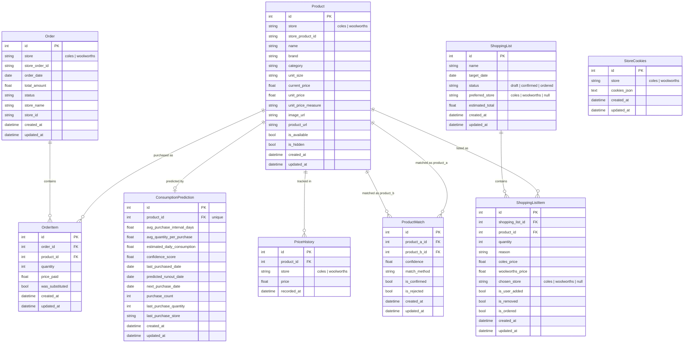

# DATAMODEL.md

Data model for the shopping agent. All tables use SQLite via SQLAlchemy async ORM. Most tables include `created_at` and `updated_at` timestamps via `TimestampMixin`.

---

## Entity Relationship Diagram

---

## Tables

### `products`

The central entity. One row per unique product per store — Coles and Woolworths products are separate rows linked by `ProductMatch`.

| Column | Type | Notes |
|--------|------|-------|
| `id` | integer PK | |
| `store` | enum | `coles` or `woolworths` |
| `store_product_id` | string(64) | ID from the store's API. Unique together with `store`. |
| `name` | string(512) | |
| `brand` | string(256) | nullable |
| `category` | string(256) | nullable |
| `unit_size` | string(64) | e.g. `"500g"`, `"1L"` — nullable |
| `current_price` | float | nullable; refreshed by price refresh job |
| `unit_price` | float | nullable; price per unit measure |
| `unit_price_measure` | string(32) | nullable; e.g. `"100g"`, `"100ml"` |
| `image_url` | string(1024) | nullable |
| `product_url` | string(1024) | nullable |
| `is_available` | bool | whether the product is currently in stock |
| `is_hidden` | bool | user-flagged as no longer buying; excluded from lists/matching |

**Constraints:** `UNIQUE(store, store_product_id)`

---

### `product_matches`

Links a Coles product to a Woolworths product (or vice versa). Enables price comparison and cheapest-store selection on shopping lists.

| Column | Type | Notes |
|--------|------|-------|
| `id` | integer PK | |
| `product_a_id` | integer FK → products | |
| `product_b_id` | integer FK → products | |
| `confidence` | float | 0.0–1.0; from fuzzy-match score or `1.0` for manual matches |
| `match_method` | string(32) | `"fuzzy"`, `"manual"`, `"search"` |
| `is_confirmed` | bool | user has verified the match is correct |
| `is_rejected` | bool | user has rejected the match; excluded from future auto-matching |

**Constraints:** `UNIQUE(product_a_id, product_b_id)`

**Match methods:**
- `fuzzy` — auto-matched by rapidfuzz name similarity
- `manual` — user-created via the manual match form
- `search` — user confirmed via the search-match flow

---

### `price_history`

Append-only log of prices recorded during price refresh jobs. No timestamps mixin — has its own `recorded_at`.

| Column | Type | Notes |
|--------|------|-------|
| `id` | integer PK | |
| `product_id` | integer FK → products | |
| `store` | enum | `coles` or `woolworths` |
| `price` | float | |
| `recorded_at` | datetime | server default `now()` |

---

### `orders`

One row per order placed at a store, synced from the store's order history API.

| Column | Type | Notes |
|--------|------|-------|
| `id` | integer PK | |
| `store` | enum | `coles` or `woolworths` |
| `store_order_id` | string(64) | unique order ID from the store; used for upsert deduplication |
| `order_date` | date | |
| `total_amount` | float | nullable |
| `status` | string(32) | nullable; e.g. `"Delivered"` |
| `store_name` | string(256) | nullable; branch/fulfilment centre name |
| `store_id` | string(64) | nullable; branch ID |

**Constraints:** `UNIQUE(store_order_id)`

---

### `order_items`

Line items within an order. Each row links one product to one order with quantity and price paid.

| Column | Type | Notes |
|--------|------|-------|
| `id` | integer PK | |
| `order_id` | integer FK → orders | cascades delete |
| `product_id` | integer FK → products | |
| `quantity` | integer | |
| `price_paid` | float | per-unit price at time of purchase |
| `was_substituted` | bool | store substituted a different product |

---

### `consumption_predictions`

One row per product (unique). Derived from order history — recalculated on demand.

| Column | Type | Notes |
|--------|------|-------|
| `id` | integer PK | |
| `product_id` | integer FK → products | unique; one prediction per product |
| `avg_purchase_interval_days` | float | average days between purchases |
| `avg_quantity_per_purchase` | float | average units per order |
| `estimated_daily_consumption` | float | quantity ÷ interval |
| `confidence_score` | float | 0.0–1.0; based on purchase count and consistency |
| `last_purchased_date` | date | |
| `predicted_runout_date` | date | `last_purchased_date + avg_interval` |
| `next_purchase_date` | date | suggested reorder date |
| `purchase_count` | integer | number of orders this product appeared in |
| `last_purchase_quantity` | integer | quantity from the most recent order |
| `last_purchase_store` | string | store used for the most recent purchase |

---

### `shopping_lists`

A shopping list moves through three states: `DRAFT` (editable) → `CONFIRMED` (ready to add to cart) → `ORDERED` (done).

| Column | Type | Notes |
|--------|------|-------|
| `id` | integer PK | |
| `name` | string(128) | |
| `target_date` | date | intended shopping date |
| `status` | enum | `draft`, `confirmed`, `ordered` |
| `preferred_store` | enum | nullable; `coles` or `woolworths` if all items go to one store |
| `estimated_total` | float | nullable; sum of chosen store prices |

Only one list should be in `DRAFT` status at a time — this is the "active" list shown in the UI.

---

### `shopping_list_items`

One row per product on a shopping list. Stores both store prices so the UI can display comparison and the user/system can choose the cheaper store.

| Column | Type | Notes |
|--------|------|-------|
| `id` | integer PK | |
| `shopping_list_id` | integer FK → shopping_lists | cascades delete |
| `product_id` | integer FK → products | |
| `quantity` | integer | default 1 |
| `reason` | string(256) | nullable; why this item was added (e.g. `"predicted runout"`) |
| `coles_price` | float | nullable; price snapshotted when list was generated |
| `woolworths_price` | float | nullable |
| `chosen_store` | enum | nullable; `coles` or `woolworths`; set at confirm time |
| `is_user_added` | bool | false = generated from prediction |
| `is_removed` | bool | soft-delete; item hidden but row retained |
| `is_ordered` | bool | set to true after cart-add succeeds |

**Constraints:** `UNIQUE(shopping_list_id, product_id) WHERE is_removed = false`

---

### `store_cookies`

One row per store. Stores the JSON cookie array used by the httpx scraper for authenticated requests.

| Column | Type | Notes |
|--------|------|-------|
| `id` | integer PK | |
| `store` | enum | `coles` or `woolworths`; unique |
| `cookies_json` | text | JSON array of cookie dicts (from browser DevTools / Cookie-Editor) |

---

## Key Design Decisions

**Products are store-scoped.** A tin of beans at Coles and the equivalent at Woolworths are two separate `Product` rows. `ProductMatch` is the join that links them for price comparison.

**Price history is append-only.** `current_price` on `Product` is the latest known price. `PriceHistory` keeps the full time series for charting.

**Predictions are one-per-product.** `ConsumptionPrediction` has a unique constraint on `product_id` — refreshing predictions overwrites the existing row rather than appending.

**Shopping list items use soft-delete.** `is_removed = true` hides an item from the UI without deleting the row, so the unique constraint `(shopping_list_id, product_id) WHERE is_removed = false` allows the same product to be re-added after removal.

**Cookies stored in DB, not files.** `StoreCookies` keeps session cookies in SQLite so they survive container restarts without a mounted volume.
